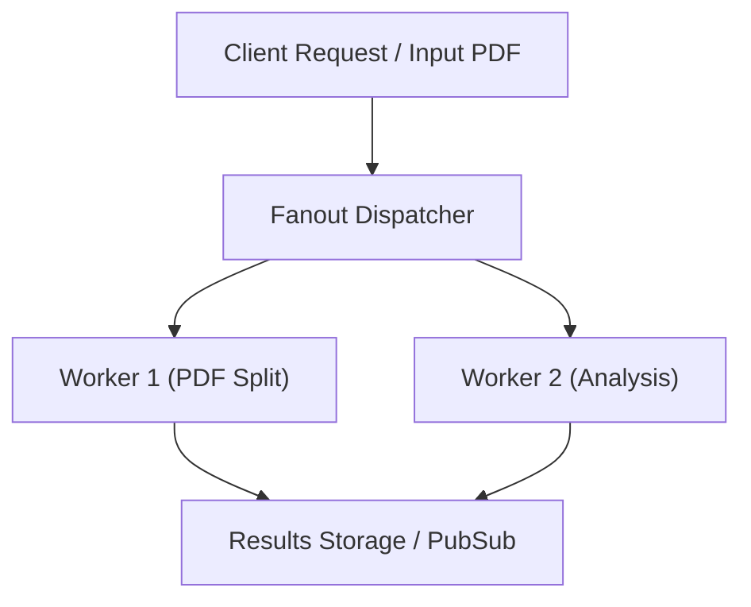

# [Document Title]

Brief 2-3 sentence overview of the component, service, or system architecture documented in this file.

---

## Architecture & Data Flow

Provide a high-level explanation of how data flows through this system.



---

## Component Overview

| Component | Location | Description |
| :--- | :--- | :--- |
| **Generator** | `generate_pdf.py` | Generates sample PDF payloads for fanout analysis. |
| **Cloud Functions** | `cloud_functions/` | Event-driven processing for PDF chunks. |
| **Infrastructure** | `infra/` | Terraform configurations for GCP resources. |

---

## Configuration & Setup

### Environment Variables

| Variable | Description | Default | Required |
| :--- | :--- | :--- | :--- |
| `GCP_PROJECT_ID` | Project ID for Cloud Functions and Pub/Sub. | None | Yes |
| `FANOUT_TOPIC` | Pub/Sub topic name for task fanout. | `pdf-fanout-topic` | Yes |

---

## Usage Examples

```bash
# Example command to trigger PDF generation and fanout
python generate_pdf.py --output sample.pdf --fanout
```

> [!TIP]
> Ensure GCP credentials are active before running local fanout triggers.

---

## Troubleshooting & FAQ

> [!WARNING]
> High PDF chunk counts can trigger rate limits if Pub/Sub concurrency is unconstrained.

- **Issue**: Fanout task timing out.
  - **Resolution**: Check Cloud Function memory limits and increase timeout configuration in `infra/`.
