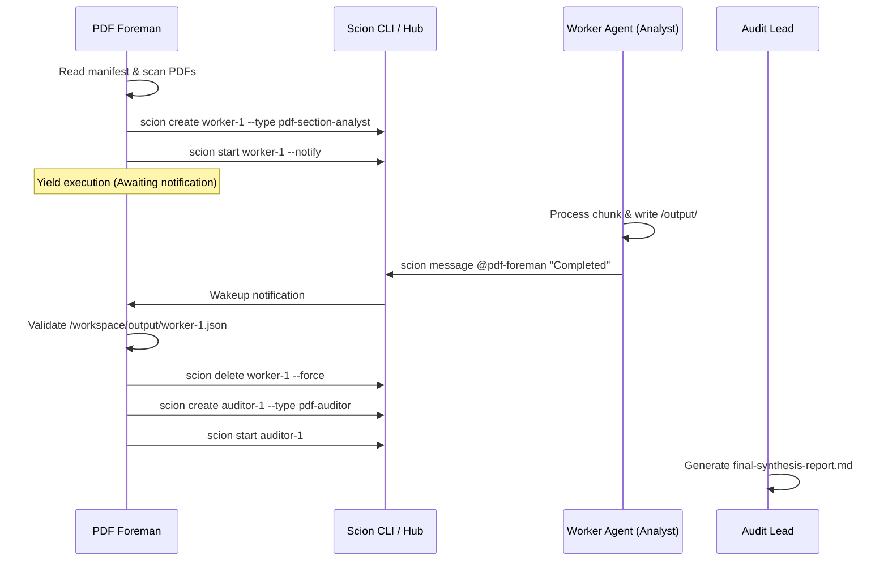

# Foreman Fanout Orchestration Skill

This skill equips the foreman agent (`pdf-foreman`) with operational protocols and execution logic for driving multi-agent fanout pipelines on Scion.

## Principles of Foreman Orchestration
1. **Never Process Linearly**: The foreman coordinates, assigns tasks, and synthesizes results. Heavy extraction and granular analysis are delegated to worker agents.
2. **Managed Concurrency**: Dispatch agents in controlled concurrency waves (typically 3–5 parallel agents) to optimize host memory and API quotas.
3. **Event-Driven Non-Blocking Execution**: Launch agents with `--notify` or listen on Scion messaging events rather than running tight polling loops.
4. **State Persistence**: Track batch state, assigned documents, and worker health in `/workspace/.foreman-state.json`.
5. **Resource Reclamation**: Terminate and clean up completed worker agents (`scion delete <agent> --force`) once output artifacts are verified.

---

## Orchestration Lifecycle



---

## Execution Commands

### 1. Provisioning a Worker
```bash
scion create extractor-01 "Extract /workspace/docs/financials.pdf" --type pdf-extractor
scion start extractor-01 --notify
```

### 2. State File Structure (`/workspace/.foreman-state.json`)
```json
{
  "batch_id": "pdf-batch-2026-09-09",
  "status": "IN_PROGRESS",
  "workers": {
    "extractor-01": {
      "type": "pdf-extractor",
      "target_file": "financials.pdf",
      "status": "COMPLETED",
      "output": "/workspace/staging/financials/"
    },
    "analyst-01": {
      "type": "pdf-section-analyst",
      "target_chunk": "/workspace/staging/financials/chunk_001.json",
      "status": "RUNNING"
    }
  }
}
```

### 3. Output Validation & Cleanup
Before cleaning up a worker, confirm its output JSON exists and is non-empty:
```bash
if [ -s "/workspace/output/analyst-01.json" ]; then
  scion delete analyst-01 --force
fi
```
