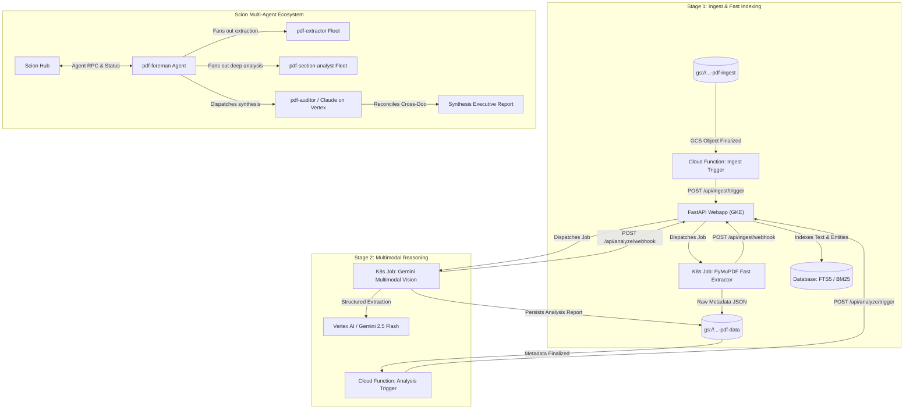

# PDF Analysis Fanout: Scion Demo Roadmap & Example Workflows

## Executive Summary

The **PDF Analysis Fanout** application is a distributed, two-stage document processing and semantic analysis pipeline running on Google Cloud Platform and GKE Autopilot. It combines rapid heuristic parsing with deep multimodal reasoning (Google Antigravity SDK & Gemini 2.5 Flash on Vertex AI).

As a **Scion Demo Application**, this repository showcases how autonomous, multi-agent AI fleets operating under Scion can build, test, refactor, and evolve a production cloud-native codebase, as well as execute complex multi-agent document processing workflows.

---

## 🏛️ Pipeline Architecture & Scion Integration

---

## 📋 Created GitHub Issues for Scion Demo Workflows

10 detailed GitHub issues have been created in [`jduncan-rva/pdf-analysis-fanout`](https://github.com/jduncan-rva/pdf-analysis-fanout/issues) spanning core Scion workflows, production scalability, reliability, domain features, and continuous delivery:

| # | Issue Title | Category | Labels | Status |
|---|---|---|---|---|
| **#1** | [[Workflow] Integrate Scion Multi-Agent Templates and Foreman Dispatch CLI](https://github.com/jduncan-rva/pdf-analysis-fanout/issues/1) | Scion Workflow | `scion-workflow`, `enhancement`, `architecture` | Open |
| **#2** | [[Architecture] Migrate Database from Local SQLite PVC to Cloud SQL (PostgreSQL) with Full-Text Search](https://github.com/jduncan-rva/pdf-analysis-fanout/issues/2) | Production Readiness | `production-readiness`, `architecture`, `enhancement` | Open |
| **#3** | [[Robustness] Asynchronous Task Queue & Event Decoupling via Google Cloud Pub/Sub](https://github.com/jduncan-rva/pdf-analysis-fanout/issues/3) | Production Readiness | `production-readiness`, `architecture` | Open |
| **#4** | [[Robustness] Distributed Job Idempotency, Leases, and Stalled Job Reaper](https://github.com/jduncan-rva/pdf-analysis-fanout/issues/4) | Production Readiness | `production-readiness`, `architecture` | Open |
| **#5** | [[CI/CD & Testing] End-to-End Test Suite, Mock Infrastructure & GitHub Actions CI/CD](https://github.com/jduncan-rva/pdf-analysis-fanout/issues/5) | Quality & DevOps | `production-readiness`, `enhancement` | Open |
| **#6** | [[Feature] Cross-Document Financial Reconciliation & Synthesis Executive Report](https://github.com/jduncan-rva/pdf-analysis-fanout/issues/6) | New Feature | `feature`, `scion-workflow`, `enhancement` | Open |
| **#7** | [[Feature] Real-Time Status Streaming via Server-Sent Events (SSE) and Live Progress Drawer](https://github.com/jduncan-rva/pdf-analysis-fanout/issues/7) | New Feature | `feature`, `enhancement` | Open |
| **#8** | [[Feature] Batch Ingestion & Directory Fanout with Aggregate Progress Tracking](https://github.com/jduncan-rva/pdf-analysis-fanout/issues/8) | New Feature | `feature`, `scion-workflow`, `enhancement` | Open |
| **#9** | [[Workflow] Human-in-the-Loop (HITL) Verification & Side-by-Side Document Reviewer](https://github.com/jduncan-rva/pdf-analysis-fanout/issues/9) | Scion Workflow | `scion-workflow`, `feature`, `enhancement` | Open |
| **#10** | [[Feature] Multi-Format Data Export (CSV, Excel, BigQuery Sync) for Financial Data](https://github.com/jduncan-rva/pdf-analysis-fanout/issues/10) | New Feature | `feature`, `enhancement` | Open |

---

## 🎯 Issue Breakdown & Scion Agent Playbooks

### 1. Issue #1: In-Repo Scion Templates & Foreman Dispatch
- **Agent Focus:** Embeds `.scion/templates/` (`pdf-foreman`, `pdf-extractor`, `pdf-section-analyst`, `pdf-auditor`, `claude-pdf-auditor`) and builds a dispatch module in the web application.
- **Scion Demo Value:** Demonstrates how Scion agents can self-orchestrate and dispatch specialized sub-agents to complete complex multi-document workflows.

### 2. Issue #2: Cloud SQL (PostgreSQL) Database Migration
- **Agent Focus:** Replaces local SQLite + single PVC with asynchronous SQLAlchemy 2.0 / `asyncpg`, PostgreSQL `tsvector` full-text search, and Alembic migrations.
- **Scion Demo Value:** Shows how an agent can refactor core data layers, generate migrations, and update Kubernetes deployment manifests to enable multi-replica horizontal autoscaling (HPA).

### 3. Issue #3: Pub/Sub Async Task Queue Decoupling
- **Agent Focus:** Replaces direct synchronous HTTP POSTs with Google Cloud Pub/Sub topics (`pdf-ingest-requests`, `pdf-analysis-requests`, `pdf-status-events`), Dead-Letter Topics (DLT), and exponential backoff.
- **Scion Demo Value:** Demonstrates cloud infrastructure hardening and asynchronous event-driven system architecture.

### 4. Issue #4: Distributed Job Idempotency & Stalled Job Reaper
- **Agent Focus:** Implements distributed lease locks to prevent duplicate job execution and a background reaper task to detect and recover orphaned/crashed jobs.
- **Scion Demo Value:** Illustrates defensive programming, distributed systems edge case handling, and self-healing systems.

### 5. Issue #5: Comprehensive Test Suite & GitHub Actions CI/CD
- **Agent Focus:** Creates full test coverage (FastAPI routes, PyMuPDF heuristics, Gemini parsers, mock GCS/K8s/Vertex AI) and GitHub Actions CI/CD workflows (`.github/workflows/ci.yml`).
- **Scion Demo Value:** Highlights how Scion agents write comprehensive unit/integration tests and establish CI quality gates.

### 6. Issue #6: Cross-Document Financial Reconciliation
- **Agent Focus:** Builds an audit engine that cross-references invoices, bank statements, and tax returns (e.g. 1040 vs W-2/1099), producing synthesis reports with page citations.
- **Scion Demo Value:** Showcases advanced multi-agent business logic and synthesis capabilities.

### 7. Issue #7: Server-Sent Events (SSE) & Live Progress Drawer
- **Agent Focus:** Replaces 5-second polling with real-time SSE streaming and adds a collapsible live activity feed / agent logs drawer in the Web UI.
- **Scion Demo Value:** Shows full-stack UI/API development with modern streaming patterns.

### 8. Issue #8: Batch Ingestion & Directory Fanout
- **Agent Focus:** Adds support for ingesting GCS prefixes and `manifest.json` batch files, aggregate progress tracking, and batch retry actions.
- **Scion Demo Value:** Demonstrates high-throughput batch processing and concurrency management.

### 9. Issue #9: Human-in-the-Loop (HITL) Verification & Reviewer UI
- **Agent Focus:** Introduces `NEEDS_REVIEW` routing for flagged anomalies, side-by-side split screen PDF preview, and audit trail logging.
- **Scion Demo Value:** Highlights the core Scion philosophy of human-in-the-loop oversight and interactive agent collaboration.

### 10. Issue #10: Multi-Format Data Export & BigQuery Lakehouse Sync
- **Agent Focus:** Adds CSV and Excel export endpoints with formatting, and an optional streaming sink into partitioned BigQuery tables.
- **Scion Demo Value:** Demonstrates downstream analytics integration and enterprise data interoperability.
