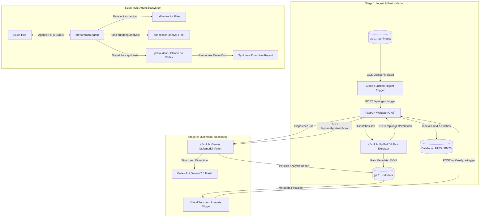

# PDF Analysis Fanout: Scion Demo Roadmap & Example Workflows

## Executive Summary

The **PDF Analysis Fanout** application is a distributed, two-stage document processing and semantic analysis pipeline running on Google Cloud Platform and GKE Autopilot. It combines rapid heuristic parsing with deep multimodal reasoning (Google Antigravity SDK & Gemini 2.5 Flash on Vertex AI).

As a **Scion Demo Application**, this repository showcases how autonomous, multi-agent AI fleets operating under Scion can build, test, refactor, and evolve a production cloud-native codebase, as well as execute complex multi-agent document processing workflows.

---

## 🏛️ Pipeline Architecture & Scion Integration



---

## 📋 Created GitHub Issues for Scion Demo Workflows

10 detailed GitHub issues have been created in [`jduncan-rva/pdf-analysis-fanout`](https://github.com/jduncan-rva/pdf-analysis-fanout/issues) spanning core Scion workflows, production scalability, reliability, domain features, and continuous delivery:

| # | Issue Title | Category | Labels | Status |
|---|---|---|---|---|
| **#1** | [[Workflow] Integrate Scion Multi-Agent Templates and Foreman Dispatch CLI](https://github.com/jduncan-rva/pdf-analysis-fanout/issues/1) | Scion Workflow | `scion-workflow`, `enhancement`, `architecture` | Open |
| **#2** | [[Architecture] Migrate Database from Local SQLite PVC to Cloud SQL (PostgreSQL) with Full-Text Search](https://github.com/jduncan-rva/pdf-analysis-fanout/issues/2) | Production Readiness | `production-readiness`, `architecture`, `enhancement` | Open |
| **#3** | [[Robustness] Asynchronous Task Queue & Event Decoupling via Google Cloud Pub/Sub](https://github.com/jduncan-rva/pdf-analysis-fanout/issues/3) | Production Readiness | `production-readiness`, `architecture` | Open |
| **#4** | [[Robustness] Distributed Job Idempotency, Leases, and Stalled Job Reaper](https://github.com/jduncan-rva/pdf-analysis-fanout/issues/4) | Production Readiness | `production-readiness`, `architecture` | Open |
| **#5** | [[CI/CD & Testing] End-to-End Test Suite, Mock Infrastructure & GitHub Actions CI/CD](https://github.com/jduncan-rva/pdf-analysis-fanout/issues/5) | Quality & DevOps | `production-readiness`, `enhancement` | Open |
| **#6** | [[Feature] Cross-Document Financial Reconciliation & Synthesis Executive Report](https://github.com/jduncan-rva/pdf-analysis-fanout/issues/6) | New Feature | `feature`, `scion-workflow`, `enhancement` | Open |
| **#7** | [[Feature] Real-Time Status Streaming via Server-Sent Events (SSE) and Live Progress Drawer](https://github.com/jduncan-rva/pdf-analysis-fanout/issues/7) | New Feature | `feature`, `enhancement` | Open |
| **#8** | [[Feature] Batch Ingestion & Directory Fanout with Aggregate Progress Tracking](https://github.com/jduncan-rva/pdf-analysis-fanout/issues/8) | New Feature | `feature`, `scion-workflow`, `enhancement` | Open |
| **#9** | [[Workflow] Human-in-the-Loop (HITL) Verification & Side-by-Side Document Reviewer](https://github.com/jduncan-rva/pdf-analysis-fanout/issues/9) | Scion Workflow | `scion-workflow`, `feature`, `enhancement` | Open |
| **#10** | [[Feature] Multi-Format Data Export (CSV, Excel, BigQuery Sync) for Financial Data](https://github.com/jduncan-rva/pdf-analysis-fanout/issues/10) | New Feature | `feature`, `enhancement` | Open |

---

## 🎯 Issue Breakdown & Scion Agent Playbooks

### 1. Issue #1: In-Repo Scion Templates & Foreman Dispatch
- **Agent Focus:** Embeds `.scion/templates/` (`pdf-foreman`, `pdf-extractor`, `pdf-section-analyst`, `pdf-auditor`, `claude-pdf-auditor`) and builds a dispatch module in the web application.
- **Scion Demo Value:** Demonstrates how Scion agents can self-orchestrate and dispatch specialized sub-agents to complete complex multi-document workflows.

### 2. Issue #2: Cloud SQL (PostgreSQL) Database Migration
- **Agent Focus:** Replaces local SQLite + single PVC with asynchronous SQLAlchemy 2.0 / `asyncpg`, PostgreSQL `tsvector` full-text search, and Alembic migrations.
- **Scion Demo Value:** Shows how an agent can refactor core data layers, generate migrations, and update Kubernetes deployment manifests to enable multi-replica horizontal autoscaling (HPA).

### 3. Issue #3: Pub/Sub Async Task Queue Decoupling
- **Agent Focus:** Replaces direct synchronous HTTP POSTs with Google Cloud Pub/Sub topics (`pdf-ingest-requests`, `pdf-analysis-requests`, `pdf-status-events`), Dead-Letter Topics (DLT), and exponential backoff.
- **Scion Demo Value:** Demonstrates cloud infrastructure hardening and asynchronous event-driven system architecture.

### 4. Issue #4: Distributed Job Idempotency & Stalled Job Reaper
- **Agent Focus:** Implements distributed lease locks to prevent duplicate job execution and a background reaper task to detect and recover orphaned/crashed jobs.
- **Scion Demo Value:** Illustrates defensive programming, distributed systems edge case handling, and self-healing systems.

### 5. Issue #5: Comprehensive Test Suite & GitHub Actions CI/CD
- **Agent Focus:** Creates full test coverage (FastAPI routes, PyMuPDF heuristics, Gemini parsers, mock GCS/K8s/Vertex AI) and GitHub Actions CI/CD workflows (`.github/workflows/ci.yml`).
- **Scion Demo Value:** Highlights how Scion agents write comprehensive unit/integration tests and establish CI quality gates.

### 6. Issue #6: Cross-Document Financial Reconciliation
- **Agent Focus:** Builds an audit engine that cross-references invoices, bank statements, and tax returns (e.g. 1040 vs W-2/1099), producing synthesis reports with page citations.
- **Scion Demo Value:** Showcases advanced multi-agent business logic and synthesis capabilities.

### 7. Issue #7: Server-Sent Events (SSE) & Live Progress Drawer
- **Agent Focus:** Replaces 5-second polling with real-time SSE streaming and adds a collapsible live activity feed / agent logs drawer in the Web UI.
- **Scion Demo Value:** Shows full-stack UI/API development with modern streaming patterns.

### 8. Issue #8: Batch Ingestion & Directory Fanout
- **Agent Focus:** Adds support for ingesting GCS prefixes and `manifest.json` batch files, aggregate progress tracking, and batch retry actions.
- **Scion Demo Value:** Demonstrates high-throughput batch processing and concurrency management.

### 9. Issue #9: Human-in-the-Loop (HITL) Verification & Reviewer UI
- **Agent Focus:** Introduces `NEEDS_REVIEW` routing for flagged anomalies, side-by-side split screen PDF preview, and audit trail logging.
- **Scion Demo Value:** Highlights the core Scion philosophy of human-in-the-loop oversight and interactive agent collaboration.

### 10. Issue #10: Multi-Format Data Export & BigQuery Lakehouse Sync
- **Agent Focus:** Adds CSV and Excel export endpoints with formatting, and an optional streaming sink into partitioned BigQuery tables.
- **Scion Demo Value:** Demonstrates downstream analytics integration and enterprise data interoperability.

---

## 🚀 Delivered Demo Components & Session Achievements

In this session, the foundational demo workflows, agent skills suite, telemetry pipeline, and Hub synchronization were implemented and verified end-to-end:

### 1. Modular Scion Agent Skills Suite (`examples/pdf-analysis-fanout/skills/`)
- **`pdf-layout-extractor`**: Layout structure parsing, chunk schema validation (`references/schema.json`), and PyMuPDF helper script (`scripts/extract_chunks.py`).
- **`financial-reconciliation`**: Cross-document financial calculations, variance threshold categorization (`references/reconciliation-rules.md`), and markdown matrix templates (`templates/reconciliation-matrix.md`).
- **`citation-auditor`**: Ground-truth claim auditing, hallucination detection, bracketed notation `[^doc:pXX]`, and citation style guide (`references/citation-style-guide.md`).
- **`foreman-fanout-orchestration`**: Async non-blocking agent dispatch (`--notify`), worker state machines, error recovery, and resource reclamation (`references/coordination-protocol.md`).

### 2. Multi-Agent Fleet Templates (`examples/pdf-analysis-fanout/templates/`)
- **`pdf-foreman`**: Orchestrates fanout batches, manages worker lifecycles, mounts `foreman-fanout-orchestration` & `citation-auditor`.
- **`pdf-extractor`**: Extracts layouts, text, and tables, mounts `pdf-layout-extractor`.
- **`pdf-section-analyst`**: Evaluates chunks in parallel, mounts `pdf-layout-extractor`, `financial-reconciliation`, and `citation-auditor`.
- **`pdf-auditor`**: Antigravity-powered cross-document synthesis, mounts `financial-reconciliation` and `citation-auditor`.
- **`claude-pdf-auditor`**: Claude-on-Vertex cross-document audit lead, mounts `financial-reconciliation` and `citation-auditor`.

### 3. Scion Metrics & Telemetry Subsystem
- **Telemetry Configuration**: Configured `telemetry.hub.enabled: true` and `telemetry.local.console: true` across all agent templates and project `settings.yaml`.
- **Operational Guide**: Created [`examples/pdf-analysis-fanout/METRICS_DEMO.md`](./examples/pdf-analysis-fanout/METRICS_DEMO.md) detailing hook capture, `MetricsPayload` schema, Hub database persistence, and REST aggregation endpoints.
- **Executable Demo Script**: Created [`examples/pdf-analysis-fanout/scripts/demo_metrics.sh`](./examples/pdf-analysis-fanout/scripts/demo_metrics.sh) (`chmod +x`), which simulates session metrics, demonstrates `sciontool` JSON transmissions, and renders an aggregated terminal summary dashboard.

### 4. Hub & Local Registry Synchronization
- Pushed and synchronized all 9 templates across global and project scopes to the running Scion Hub:
  ```text
  TEMPLATE             LOCAL  HUB  STATUS
  claude-pdf-auditor   yes    yes  synced (hash match)
  docs-writer          yes    yes  synced (hash match)
  instance-manager     yes    yes  synced (hash match)
  pdf-auditor          yes    yes  synced (hash match)
  pdf-extractor        yes    yes  synced (hash match)
  pdf-foreman          yes    yes  synced (hash match)
  pdf-section-analyst  yes    yes  synced (hash match)
  release-notes        yes    yes  synced (hash match)
  web-dev              yes    yes  synced (hash match)
  ```

### 5. Automated Validation & Quality Gates
- Added unit test [`TestPDFFanoutTemplates_LoadAndValidate`](./pkg/config/templates_test.go) verifying that all templates parse cleanly, validate against the agnostic template schema, mount all required skills, and have telemetry enabled.

### 6. Hosted GKE Cloud Monitoring & Metrics Dashboard Configuration
- **Root Cause Resolution**: Resolved the Web UI `503 Service Unavailable` (`"Metrics dashboard is not configured (no telemetry project ID)"`) on GKE by supplying the GCP Telemetry project configuration.
- **GKE Secrets & ConfigMap**:
  - Configured `telemetry.cloud` (`gcp_project_id: gke-llm-testing-env`) in the `scion-hub-settings` Kubernetes Secret (`scion-system` namespace).
  - Configured `SCION_TELEMETRY_GCP_PROJECT_ID` and `SCION_GCP_PROJECT_ID` in `scion-hub-env` ConfigMap.
- **GCP IAM & Workload Identity**:
  - Bound `roles/monitoring.viewer`, `roles/monitoring.metricWriter`, and `roles/logging.logWriter` to the GKE Hub runner service account (`scion-hub-runner@gke-llm-testing-env.iam.gserviceaccount.com`).
### 7. Hosted Claude on Vertex AI Harness & GKE Execution
- **Hub Scope Environment Storage**: Injected required Vertex AI environment variables (`GOOGLE_CLOUD_PROJECT`, `GOOGLE_CLOUD_REGION`, `GOOGLE_CLOUD_LOCATION`, `CLOUD_ML_REGION`, `CLAUDE_CODE_USE_VERTEX`, `ANTHROPIC_VERTEX_PROJECT_ID`) at `hub` scope with `always` injection mode via the Hub API.
- **Container Image Build & Registry Deployment**:
  - Updated `harnesses/claude/cloudbuild.yaml` with configurable architecture platform substitution `_PLATFORM` (defaulting to `linux/amd64`).
  - Built and deployed `scion-claude:latest` to Google Artifact Registry (`us-central1-docker.pkg.dev/gke-llm-testing-env/scion/scion-claude:latest`).
- **Live GKE Validation**: Verified that Claude agents (`claude-probe` with template `claude-pdf-auditor`) start cleanly on GKE with tmux, OpenTelemetry GCP cloud exporter, git workspace cloning, and Vertex AI authentication.

### 8. Claude Harness Settings & Interactive Hook Sanitization (Claude Code 2.1 Compatibility)
- **Problem & Symptoms**: Starting a Claude agent on GKE presented an interactive blocking TTY warning prompt (*"Settings Warning: /home/scion/.claude/settings.json"*), causing the agent process to stall waiting for user input:
  - `hooks.ModelResponse`: Unknown hook event "ModelResponse" was ignored.
  - `permissions.allow`: Invalid permission rule "*": Wildcard tool name "*" is not supported in allow rules.
- **Root Cause**:
  - Claude Code 2.1+ enforces strict validation on `settings.json`. Wildcard `*` in `permissions.allow` is rejected as invalid syntax (tool permission bypass in Scion is handled via the `--dangerously-skip-permissions` CLI flag).
  - Claude Code does not support a `ModelResponse` hook event. Registering it triggered Claude Code's interactive configuration recovery menu.
- **Resolution**:
  - Updated `harnesses/claude/home/.claude/settings.json` to remove the invalid wildcard `allow` entry and `ModelResponse` hook registration while preserving strict `deny` rules and lifecycle status hooks (`SessionStart`, `SessionEnd`, `PreToolUse`, `PostToolUse`, `Stop`, `SubagentStop`, `UserPromptSubmit`, `Notification`).
  - Synced the updated global Claude harness-config to the Hub (`scion harness-config install harnesses/claude --global`).
  - Anchored root `.claude/` pattern in `.gitignore` to `/.claude/` to ensure harness template files remain properly tracked by git.
- **Verification**: Verified that `claude-probe` starts cleanly on GKE with Claude Code v2.1.266 directly into the Vertex AI Opus interactive shell without warning prompts or stalls.


